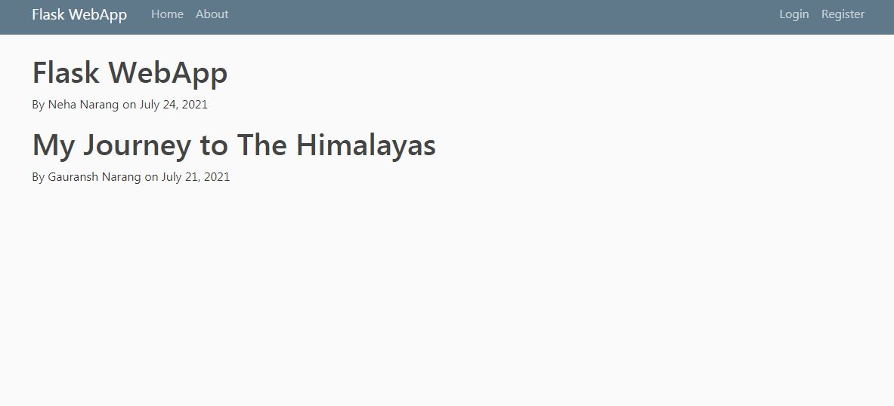

# Flask-Implementation
This repository contains a project demonstrating login page, registration page, etc using Flask. 

### Snapshots
<table> 
   <tr>
    <td width=70% height = 250>  </td> 
  </tr>
  <tr>
    <td width=70% height = 250>  </td> 
  </tr>
    <tr>
    <td width=70% height = 250>  </td> 
  </tr>
 </table>
